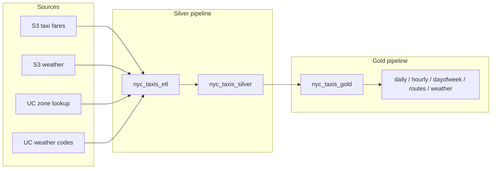

# NYC Taxis DAB

NYC taxi fare ETL on Databricks, managed as a [Databricks Asset Bundle](https://docs.databricks.com/dev-tools/bundles/index.html). Raw taxi and weather data from S3 is cleansed and joined in a silver Lakeflow pipeline, then aggregated into gold analytics tables. A single job orchestrates silver → gold.

## Portfolio highlights

- **End-to-end medallion pipeline** — bronze-style S3 ingestion → silver enrichment → gold analytics, deployed and runnable on Databricks serverless.
- **Infrastructure as code** — full stack defined in YAML (bundles, pipelines, Unity Catalog schemas, orchestration job); deploy with `databricks bundle deploy`.
- **Real-world data integration** — mixed Parquet/CSV reads from S3, Unity Catalog reference joins (zones, weather codes), and time-based weather enrichment on taxi pickups.
- **Reusable Python package** — shared logic packaged as a wheel and consumed by both pipelines (S3 readers, column mappings, cross-layer table access).
- **Production-minded patterns** — partitioned silver table, dev-mode schema handling for cross-pipeline reads, and a job that chains silver → gold with task dependencies.

**Stack:** Databricks Lakeflow (Spark Declarative Pipelines), PySpark, Unity Catalog, AWS S3, Databricks Asset Bundles, Python.

## Architecture



## Project layout

```
├── databricks.yml                 # bundle config, variables, dev target
├── pyproject.toml                 # Python package (wheel for pipelines)
├── resources/
│   ├── schemas.yml                # Unity Catalog silver + gold schemas
│   ├── nyc_taxis_etl.pipeline.yml # silver Lakeflow pipeline
│   ├── nyc_taxis_gold.pipeline.yml
│   └── nyc_taxis_job.job.yml      # orchestration: silver → gold
├── src/
│   ├── nyc_taxis_dab/             # shared package (S3 readers, mappings)
│   ├── nyc_taxis_etl/             # silver transformations
│   └── nyc_taxis_gold/            # gold aggregations
└── tests/
```

## Data sources

| Source | Location |
|--------|----------|
| Taxi fares | `s3://nyc-taxis-traffic-analysis-raw/stg_taxis_data/` (Parquet + CSV) |
| Weather | `s3://nyc-taxis-traffic-analysis-raw/weather/` (Parquet + CSV) |
| Zone lookup | `nyc_taxis_weather.bronze_nyc_taxis.b_taxi_zone_lookup` |
| Weather codes | `nyc_taxis_weather.bronze_nyc_taxis.b_weather_codes` |

Output catalog: `nyc_taxi_fares_analysis` (silver and gold schemas defined in `resources/schemas.yml`).

## Pipelines & tables

**Silver (`nyc_taxis_etl`)** — reads raw S3 data, joins zone lookup and weather codes, writes:

| Table | Description |
|-------|-------------|
| `nyc_taxis_silver` | Cleansed, enriched trip records (partitioned by `pickup_date`) |

**Gold (`nyc_taxis_gold`)** — reads silver, writes:

| Table | Description |
|-------|-------------|
| `daily_metrics` | Trip counts and fare stats by day |
| `hourly_metrics` | Metrics by hour of day |
| `dayofweek_metrics` | Metrics by day of week |
| `top_routes` | Most common pickup → dropoff routes |
| `weather_metrics` | Trip stats grouped by weather conditions |

## Prerequisites

- [Databricks CLI](https://docs.databricks.com/dev-tools/cli/index.html) v1.x, authenticated to your workspace
- Python 3.10+
- Unity Catalog catalog `nyc_taxi_fares_analysis` and read access to the S3 / reference tables above

Workspace host and paths are configured under `targets.dev` in `databricks.yml`.

## Local setup

```bash
# install uv: https://docs.astral.sh/uv/getting-started/installation/
uv sync --dev
```

## Deploy

```bash
databricks bundle validate
databricks bundle deploy
```

The bundle builds a Python wheel (`dist/*.whl`) and deploys pipelines, schemas, and the orchestration job. In **development mode**, resource names are prefixed with `[dev <username>]` — for example, the silver schema becomes `dev_<user>_silver_taxi_fares`. The gold pipeline uses `silver_schema_read` in `databricks.yml` so cross-pipeline reads resolve to the dev-prefixed schema.

## Run

**Full ETL (recommended)** — silver then gold in one job:

```bash
databricks bundle run nyc_taxis_job
```

**Individual pipelines:**

```bash
# silver only
databricks bundle run nyc_taxis_etl

# gold only (requires silver to exist)
databricks bundle run nyc_taxis_gold

# full refresh of silver
databricks bundle run nyc_taxis_etl --full-refresh-all
```

## Tests

```bash
uv run pytest
```
